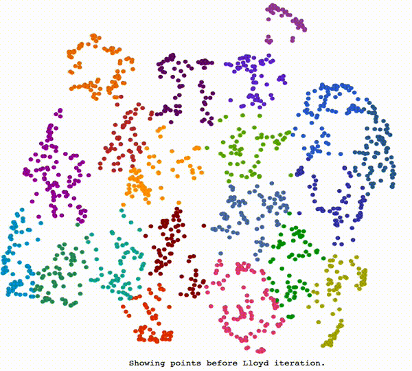

# Lloyd's Algorithm

This package offers a Python implementation of Lloyd's algorithm, which can be used to distribute points in space. Using this algorithm, one can slightly rearrange points within a two-dimensional space in order to minimize the number of overlapping points while retaining the overall point distribution, which can greatly improve the usability of data visualizations.

## Background

[Lloyd iteration](https://en.wikipedia.org/wiki/Lloyd%27s_algorithm) is an algorithm for distributing points in a space. During each iteration, the algorithm builds a <a href='https://en.wikipedia.org/wiki/Voronoi_diagram'>Voronoi diagram</a> that places each point into a distinct cell, then centers each point within its cell. By running several iterations of the algorithm, one can distribute points more and more uniformly in space. The image below shows how Lloyd's algorithm distributes points in space:



## Usage

This package can be installed with pip:

```bash
pip install lloyd
```

After installing the package, one can transform the positions of points within a two-dimensional numpy array by building a model, calling the `lloyd.relax()` method on that model, then calling `lloyd.get_points()` to get the projected point positions:

```python
from lloyd import Field
import numpy as np

# generate 2000 observations with 2 dimensions
points = np.random.rand(2000, 2)

# create a lloyd model on which one can perform iterations
field = Field(points)

# run one iteration of Lloyd relaxation on the field of points
field.relax()

# get the resulting point positions
new_positions = field.get_points()
```

`new_positions` will then be a numpy array with the same shape as `points`, only the positions of each point will be shifted slightly so as to minimize the number of overlapping points. To continue pushing points farther from one another, one can simply call the `.relax()` method on the lloyd model.

## Visualizing Voronoi Maps

For examples of how to visualize the Voronoi maps created during each iteration of the model, see the attached notebook.

## Constrained Lloyd Iteration

Lloyd iteration is an unconstrained algorithm. During each iteration, Lloyd's algorithm constructs a new Voronoi diagram and then centers each point within its cell. This means that points near the convex hull (the outside boundary) of a distribution tend towards infinity as one continues to run Lloyd iterations.

To solve this problem, this module implements internal constraints that ensure points remain within the input point domain after the model iterates. This ensures points near the convex hull do not disappear into the abyss as one continues running iterations.